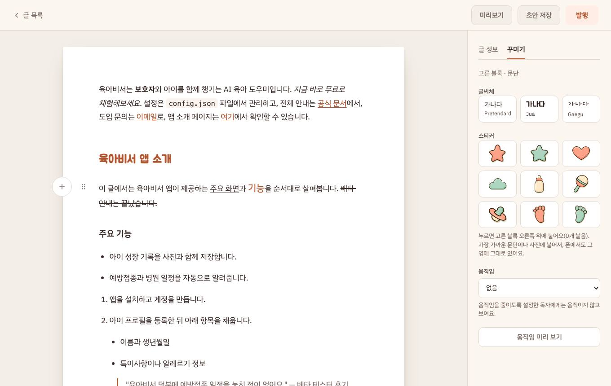
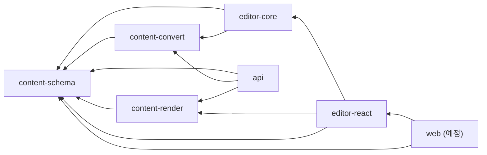
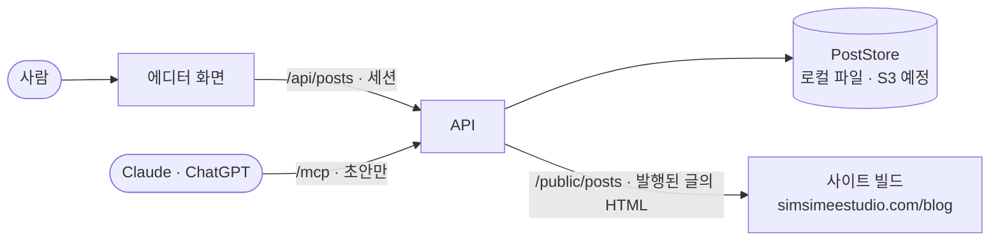

# blog-editor

심심이스튜디오 블로그([simsimeestudio.com/blog](https://simsimeestudio.com/blog))의 글을 쓰는 백오피스 에디터다.

- 글은 zod가 정의한 **문서 JSON**으로 저장한다. markdown은 가져오기 · AI 입력용일 뿐 원본이 아니다([ADR-003](adr/2026-09-22-adr-003-json-document-is-source-of-truth.md)).
- 공개 사이트는 이 레포와 코드를 나누지 않는다. 빌드할 때 이 서비스의 공개 API에서 메타와 **렌더된 HTML**을 받아 간다([ADR-001](adr/2026-09-22-adr-001-separate-backoffice-html-over-http.md)).
- Claude · ChatGPT는 MCP 커넥터로 연결해 **초안만** 쓴다. 발행은 사람이 에디터에서 한다([ADR-007](adr/2026-09-22-adr-007-mcp-connector-drafts-only-two-phases.md)).
- 지금은 본인용 1단계다(계정 하나). 에디터 주소 `editor.simsimeestudio.com`은 배포(M4) 뒤에 연다.



## 주요 기능

지금 `main`에 있는 것만 적는다.

**에디터**

- TipTap v3 위에 직접 정의한 닫힌 스키마: 문단 · 제목 · 목록 · 인용 · 코드 · 구분선 · 그림 · 콜아웃(메모 · 팁 · 주의) · 앱 스크린샷 프레임
- Notion식 입력: `## ` · `- ` · `1. ` · `> ` · `---` · ` ``` ` 자동 서식, `**굵게**` 같은 인라인 규칙, ⌘B · ⌘I · ⌘K 등 단축키
- 블록 손잡이: 끌어서 옮기기(잔상 · 자동 스크롤), 누르면 블록 메뉴(바꾸기 · 복제 · 지우기), 「블록 추가」 메뉴
- 목록 키(Enter · Tab · Shift-Tab · Backspace), 되돌리기 · 다시 하기(⌘Z · ⌘⇧Z)
- 붙여넣기 정규화 — 밖에서 붙인 HTML도 닫힌 집합으로 거른다

**꾸미기**([ADR-008](adr/2026-09-22-adr-008-decoration-closed-set-block-relative.md) · [ADR-020](adr/2026-09-24-adr-020-decoration-v2-text-style-align.md))

- 블록 글꼴 3종 · 움직임 · 그림 폭(도구줄과 좌우 손잡이) · 스티커 9종(블록 기준 비율로 붙고, 끌기 · 크기 · 회전)
- 글자 스타일(글꼴 · 두께 · 크기 · 글자색 · 배경색) · 취소선 · 밑줄 · 정렬: 저장 형식 · 공개 HTML · AI 마크다운 문법까지 있다. 에디터 도구줄 UI는 아직이다

**서버와 AI 연결**

- 로그인(아이디 · 비밀번호, HMAC 세션 쿠키, 실패 5회면 15분 잠금), 글 목록 · 읽기 · 저장(`/api/posts`), 발행된 글만 내보내는 공개 API(`/public/posts`)
- MCP 커넥터(`/mcp`): 글쓰기 가이드 읽기 · 글 목록 · 글 읽기 · 초안 검사 · 초안 만들기. 발행 도구는 없다
- 연결은 연결용 토큰(Bearer) 또는 OAuth(DCR · PKCE S256) — [ADR-016](adr/2026-09-24-adr-016-mcp-server-sdk-connection-token.md) · [ADR-018](adr/2026-09-24-adr-018-mcp-oauth-authorization-server-in-service.md)

**예정** — 백오피스 화면(로그인 · 글 목록 · 저장 · 발행), 이미지 올리기, AWS 배포. 진행은 [마일스톤](https://github.com/cgamja/blog-editor/milestones) M3~M6.

## 기술 스택

| 영역            | 기술                                                      | 선택 이유                                                                                                                                                                              |
| --------------- | --------------------------------------------------------- | -------------------------------------------------------------------------------------------------------------------------------------------------------------------------------------- |
| 모노레포        | pnpm 11 워크스페이스, TypeScript 5.9, Node 22 이상        | 패키지 경계를 린트로 강제한다 — [ADR-009](adr/2026-09-22-adr-009-package-boundaries.md)                                                                                                |
| 문서 형식       | zod 4                                                     | 문서에 들어갈 수 있는 것을 한 곳에서 정의한다 — [ADR-003](adr/2026-09-22-adr-003-json-document-is-source-of-truth.md)                                                                  |
| markdown → 문서 | prosemirror-markdown 1.13 · markdown-it 14                | 토큰 단계에서 먼저 검사한다 — [ADR-013](adr/2026-09-23-adr-013-markdown-parser-prosemirror-markdown.md)                                                                                |
| 에디터          | TipTap 3.31 (ProseMirror)                                 | 핵심 로직은 ProseMirror 순수 함수로 — [ADR-002](adr/2026-09-22-adr-002-tiptap-v3-prosemirror-core.md) · [ADR-017](adr/2026-09-24-adr-017-editor-schema-own-extensions.md)              |
| 에디터 화면     | React 19.3 · Vite 8                                       | [ADR-019](adr/2026-09-24-adr-019-editor-react-tiptap-react-vite.md) · 백오피스 화면은 React Router · TanStack Query 예정([ADR-006](adr/2026-09-22-adr-006-vite-spa-tanstack-query.md)) |
| API             | Hono 4 · `@hono/node-server`                              | M1~M3는 로컬 Node에서 — [ADR-014](adr/2026-09-23-adr-014-hono-api-local-node.md)                                                                                                       |
| AI 연결         | MCP 공식 SDK(`@modelcontextprotocol/server` 2.0)          | 무상태 fetch 핸들러로 Hono에 붙인다 — [ADR-016](adr/2026-09-24-adr-016-mcp-server-sdk-connection-token.md)                                                                             |
| 테스트          | Vitest 5 · fast-check 4                                   | 순수 함수는 DOM 없이, 불변식은 속성 기반으로 — [ADR-012](adr/2026-09-23-adr-012-fast-check-property-tests.md)                                                                          |
| 개발 흐름       | OpenSpec · lefthook · commitlint · ESLint 10 · Prettier 3 | [ADR-010](adr/2026-09-22-adr-010-develop-workflow-tooling.md)                                                                                                                          |
| 배포(예정)      | AWS 서버리스(Lambda · API Gateway · S3 · CloudFront)      | [ADR-004](adr/2026-09-22-adr-004-s3-poststore-etag-conflict.md) · [ADR-005](adr/2026-09-22-adr-005-aws-serverless-no-waf.md)                                                           |

## 아키텍처

패키지 사이의 import는 `@blog-editor/<name>`으로만 하고, 아래 화살표 방향만 허용한다(A → B: A가 B를 가져다 쓴다). `eslint.config.mjs`가 강제하고 표는 [ADR-009](adr/2026-09-22-adr-009-package-boundaries.md)에 있다.



글이 흐르는 길:



| 패키지                     | 하는 일                                                                  |
| -------------------------- | ------------------------------------------------------------------------ |
| `packages/content-schema`  | zod 스키마 · 정규화 · 마이그레이션 · 픽스처. ProseMirror를 모른다        |
| `packages/content-convert` | markdown → 문서 변환 코어. 가져오기와 MCP 도구가 같이 쓴다               |
| `packages/content-render`  | 문서 → HTML 순수 렌더러와 본문 CSS. 미리보기와 공개 API가 같은 것을 쓴다 |
| `apps/editor/editor-core`  | TipTap 확장과 ProseMirror 순수 커맨드 · 플러그인. React가 없다           |
| `apps/editor/editor-react` | 에디터 마운트 · 블록 손잡이 · 꾸미기 패널 · 편집 화면 틀                 |
| `apps/editor/api`          | Hono(REST · `/mcp` · OAuth)와 PostStore                                  |

## 설계 원칙

- **닫힌 집합** — 문서에 들어갈 수 있는 값은 zod가 정한다. 임의 CSS · 클래스 · 페이지 좌표는 자리가 없다([ADR-008](adr/2026-09-22-adr-008-decoration-closed-set-block-relative.md) · [ADR-020](adr/2026-09-24-adr-020-decoration-v2-text-style-align.md)).
- **문서 JSON이 원본** — 정규형은 하나이고, markdown은 입력 전용이다([ADR-003](adr/2026-09-22-adr-003-json-document-is-source-of-truth.md)).
- **테스트가 명세** — 순수 함수(스키마 · 변환 · 렌더 · 커맨드 · API)는 Vitest로 DOM 없이 검사한다. 스펙 시나리오 하나가 테스트 하나다.
- **경계는 린트가 지킨다** — 의존 방향 · TipTap/React/ProseMirror가 쓰일 수 있는 패키지를 ESLint가 막는다([ADR-009](adr/2026-09-22-adr-009-package-boundaries.md)).
- **AI는 초안만** — MCP에는 발행 도구가 없다([ADR-007](adr/2026-09-22-adr-007-mcp-connector-drafts-only-two-phases.md)).

## 시작하기

```bash
pnpm install   # lefthook 훅(commit-msg · pre-commit · pre-push)도 건다
```

레포 루트에 `.env`를 만든다(gitignore됨). 값은 직접 정하고 커밋하지 않는다.

| 이름                   | 뜻                                                                                       |
| ---------------------- | ---------------------------------------------------------------------------------------- |
| `ADMIN_USERNAME`       | 로그인 아이디(없으면 `admin`)                                                            |
| `ADMIN_PASSWORD`       | 로그인 비밀번호(필수). 해시로 줄 때는 `ADMIN_PASSWORD_HASH`                              |
| `MCP_CONNECTION_TOKEN` | 있으면 `/mcp`를 연다. 32자 이상 — 만드는 법은 [docs/mcp-connect.md](docs/mcp-connect.md) |

```bash
pnpm --filter @blog-editor/api dev                       # API → http://127.0.0.1:8787
PORT=5199 pnpm --filter @blog-editor/editor-react dev    # 편집 화면 → http://127.0.0.1:5199
pnpm verify                                              # typecheck · lint · format · test · docs — 완료의 기준
```

편집 화면은 개발용 페이지다. 주소에 `?dev`를 붙이면 픽스처 고르기 · 확인 버튼 · 저장 형식 JSON이 함께 보인다(`?dev&fixture=decorationMax`처럼 픽스처도 고를 수 있다). Claude를 MCP로 붙이는 방법은 [docs/mcp-connect.md](docs/mcp-connect.md)에 있다.

## 문서

- [`adr/`](adr) — 왜 이렇게 만들었나(결정 기록, append-only)
- [`docs/`](docs) — 규약의 이유([conventions](docs/conventions.md)) · [한글 입력 체크리스트](docs/ime-checklist.md) · [AI 연결](docs/mcp-connect.md)
- [`openspec/specs/`](openspec/specs) — 기능별 행동 스펙
- [`CLAUDE.md`](CLAUDE.md) — 구조 · 규칙 · 협업 규약
- [PRD](https://claude.ai/artifact/Rm3nPgTioyyenou6MTjoNW) · [설계 결론](https://claude.ai/artifact/GXURYB4TghmCGNX5bLWQr4) · [마일스톤](https://github.com/cgamja/blog-editor/milestones)
